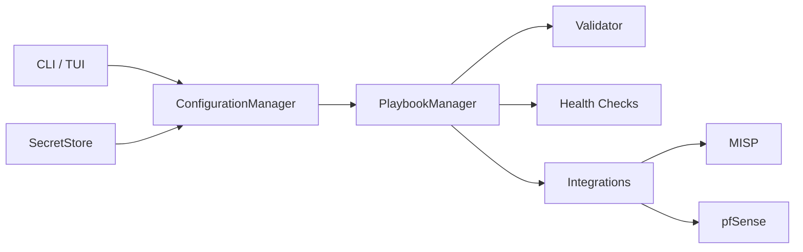

# PySOAR

A lightweight Python SOAR (Security Orchestration, Automation, and Response) framework for edge and SOHO networks.

PySOAR reads YAML integration configs and playbooks at launch, runs them statelessly, and passes indicator data between integration steps (for example MISP `ip-dst` → pfSense block rules).

## Quick start

**Requirements:** Python 3.10+, Linux or macOS (curses TUI)

```bash
git clone https://github.com/brxcybr/pySOAR.git
cd pySOAR
python3 -m venv venv && source venv/bin/activate
pip install -r requirements.txt
pip install -e .

# Mock mode — no live MISP or pfSense required
export PYSOAR_MOCK_INTEGRATIONS=1
python3 pysoar.py --run-playbook test --once
python3 pysoar.py --list-playbooks
```

## Docker lab (recommended for testing)

One-command lab with pfSense API mock and in-process integration mocks:

```bash
cp lab/.env.example lab/.env
make lab-up
make lab-test
make lab-down
```

See [docs/lab/docker-compose.md](docs/lab/docker-compose.md).

## Features (v0.5.0)

| Capability | Description |
|---|---|
| Integrations | MISP, pfSense, OPNsense, CrowdSec, Webhook |
| Playbooks | YAML branching, shared data pipeline, validation |
| Safety | Pre-launch graph validation and integration health checks |
| Triggers | `always`, `time`, declarative `condition` |
| Secrets | Fernet-encrypted API key vault + CLI management |
| CLI | Non-interactive playbook runs, secrets migration |
| Foundation | Plugin registry, action manifests, observable schema v1, audit log |
| REST API | FastAPI server with optional Bearer token auth |
| Mock mode | Offline MISP and pfSense for dev/CI |

## CLI reference

```bash
python3 pysoar.py                              # Interactive TUI
python3 pysoar.py --run-playbook test --once   # Run one playbook cycle
python3 pysoar.py --list-playbooks
python3 pysoar.py --init-secrets
python3 pysoar.py --migrate-secrets
python3 pysoar.py --set-secret misp
python3 pysoar.py --list-actions
python3 pysoar.py --serve-api --host 0.0.0.0 --port 8088
python3 pysoar.py --scheduler test --interval 300 --once
```

## Architecture



More detail: [docs/architecture/overview.md](docs/architecture/overview.md)

## Plugin integrations

Copy a template from `config/*.template.yaml` to `config/{name}.yaml`:

| Plugin | Use case |
|---|---|
| `webhook` | Slack/Discord/generic notifications |
| `crowdsec` | Ban indicators via CrowdSec LAPI |
| `opnsense` | OPNsense firewall blocking |

## Documentation

| Topic | Link |
|---|---|
| Configuration & secrets | [docs/guides/configuration.md](docs/guides/configuration.md) |
| Playbook authoring | [docs/guides/playbook-authoring.md](docs/guides/playbook-authoring.md) |
| Testing & mock mode | [docs/guides/testing.md](docs/guides/testing.md) |
| Docker lab | [docs/lab/docker-compose.md](docs/lab/docker-compose.md) |
| GNS3 / full network lab | [docs/lab/gns3-topology.md](docs/lab/gns3-topology.md) |
| REST API | [docs/api/rest-api.md](docs/api/rest-api.md) |
| Full install (Pi, MISP, GNS3) | [docs/getting-started/full-install-guide.md](docs/getting-started/full-install-guide.md) |
| Contributing | [CONTRIBUTING.md](CONTRIBUTING.md) |
| Changelog | [CHANGELOG.md](CHANGELOG.md) |

## Development

```bash
pip install -r requirements-dev.txt
make test
```

## Known limitations

- The curses TUI is functional but not complete (CLI is recommended for automation).
- Full network lab (real pfSense in GNS3) requires manual topology setup — see the full install guide.
- REST API and web UI are planned but not yet implemented.

## License

GPL-3.0 — see [LICENSE](LICENSE).
