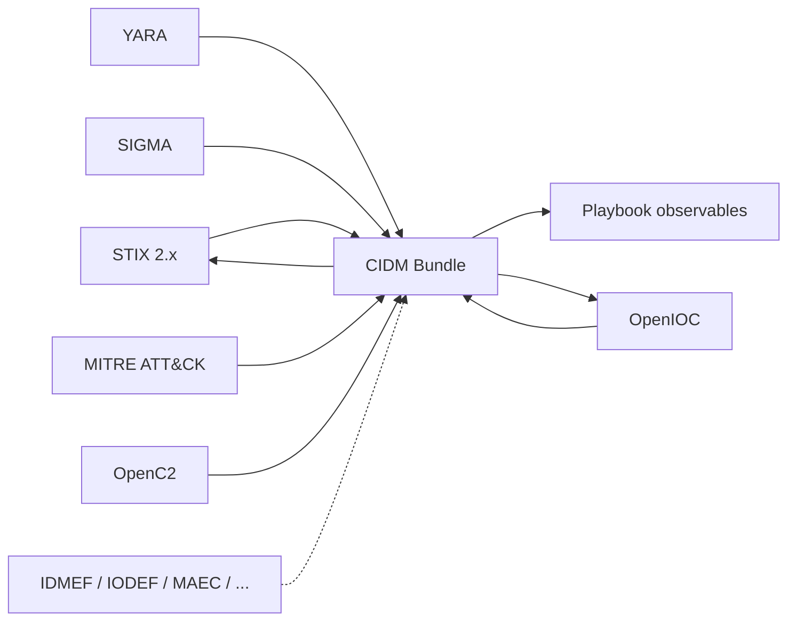

# CIDM — Common Information Data Model

PySOAR normalizes threat intelligence through **CIDM**, an internal hub format. External standards are parsed into CIDM, transformed, and exported to other standards or playbook observables.

## Architecture



## CIDM bundle structure

| Section | Purpose |
|---|---|
| `observables` | IPs, domains, URLs, hashes, etc. |
| `indicators` | STIX/OpenIOC-style patterns with nested observables |
| `detection_rules` | YARA and SIGMA content |
| `attack_patterns` | MITRE techniques |
| `relationships` | Graph links between objects |
| `openc2_commands` | Response actions |
| `generic_objects` | Future extensions |

Playbook `shared_data` may include `cidm_bundle` plus legacy flat keys (`ip-dst`, etc.) kept in sync.

## Supported formats

| Format | Status | Notes |
|---|---|---|
| **CIDM JSON** | Implemented | Native hub format |
| **STIX 2.x** | Implemented | Stdlib JSON; optional `stix2` library |
| **OpenIOC** | Implemented | XML 1.1 |
| **YARA** | Implemented | Rule structure + hash extraction |
| **SIGMA** | Implemented | YAML detection rules |
| **MITRE ATT&CK** | Implemented | STIX bundle or technique JSON |
| **OpenC2** | Implemented | JSON commands |
| **Observables** | Implemented | PySOAR playbook export |
| **TAXII** | Stub | Future client |
| **MAEC** | Stub | Map via STIX where possible |
| **VERIS** | Stub | Future |
| **CybOX** | Stub | Legacy; prefer STIX 2 |
| **IDMEF (RFC 4765)** | Stub | Future |
| **IODEF (RFC 5070)** | Stub | Future |
| **CAPEC** | Stub | Future |
| **intel.dat (MISP)** | Stub | Future MISP export adapter |

## CLI

```bash
python3 pysoar.py --list-intel-formats

python3 pysoar.py --convert-intel tests/fixtures/intel/sample_stix2.json \
  --from-format stix2 --to-format observables

python3 pysoar.py --convert-intel tests/fixtures/intel/sample_openioc.xml \
  --from-format openioc --to-format cidm --output /tmp/out.json
```

## REST API

```bash
curl -H "Authorization: Bearer $PYSOAR_API_TOKEN" \
  http://127.0.0.1:8088/intel/formats

curl -X POST http://127.0.0.1:8088/intel/convert \
  -H "Content-Type: application/json" \
  -H "Authorization: Bearer $PYSOAR_API_TOKEN" \
  -d '{"content":"...", "source_format":"openioc", "target_format":"cidm"}'
```

## Optional dependencies

```bash
pip install pysoar[intel]   # adds stix2 library for richer STIX parsing
```

## Adding a format adapter

1. Subclass `IntelFormatAdapter` in `core/cidm/formats/`
2. Implement `parse()` → `CIDMBundle` and `serialize()` ← `CIDMBundle`
3. Register in `IntelFormatRegistry._register_defaults()`
4. Add fixtures and tests in `tests/test_cidm.py`

## Mapping strategy

- **Observables** map to MISP-aligned types (`ip-dst`, `domain`, `hash`, …)
- **STIX cyber-observables** use `STIX_OBSERVABLE_MAP` in `core/cidm/types.py`
- **OpenIOC items** use `OPENIOC_TERM_MAP`
- Complex objects (campaigns, actors) land in typed CIDM sections or `generic_objects` until playbook support expands

See also: [Phase 0 foundation](phase0-foundation.md)
