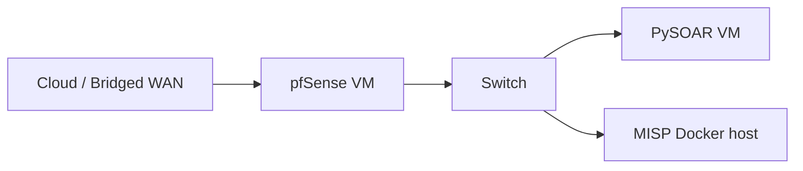

# GNS3 full network lab

The complete step-by-step GNS3 topology setup (pfSense VM, PySOAR VM, certificate management, and MISP integration) is documented in the [full install guide](../getting-started/full-install-guide.md#setup-gns3-for-testing-optional).

## Overview



## Recommended topology

| Node | Role | Notes |
|---|---|---|
| Cloud | WAN / bridged access | pfSense `vmx0` |
| pfSense 2.7 | Perimeter firewall | pfSense API package required |
| Switch | LAN segment | Connects PySOAR + MISP |
| PySOAR VM | SOAR runner | Debian/Raspbian with PySOAR installed |
| MISP | Threat intel | Typically Docker on lab host or separate VM |

## Automation options

### Tier 1 — Docker lab (no GNS3)

Use `make lab-up` for mock-based testing without network VMs. See [docker-compose.md](docker-compose.md).

### Tier 2 — Ansible host bootstrap

Provision a Debian VM and run:

```bash
cd lab/ansible
ansible-playbook -i inventory.example playbook.yml
```

This installs Docker, clones PySOAR, and runs the Docker lab smoke test.

### Tier 3 — GNS3 manual + scripts

1. Import pfSense and PySOAR VMs into GNS3 (see full install guide)
2. Generate lab certificates:

```bash
bash lab/scripts/generate-certs.sh
```

3. Install pfSense API package on the pfSense console
4. Configure `config/misp.yaml` and `config/pfsense.yaml`
5. Optionally seed MISP:

```bash
export MISP_URL=https://misp.example.com
export MISP_API_KEY=your-key
bash lab/scripts/seed-misp.sh
```

## GNS3 API automation (advanced)

GNS3 exposes a REST API for project import and node control. A future enhancement is a `lab/gns3/bootstrap.sh` script that:

1. Uploads a committed `.gns3project` file
2. Starts pfSense and PySOAR nodes
3. Polls until LAN DHCP is available
4. Invokes Ansible to configure pfSense API and PySOAR configs

For now, use the manual topology steps in the full install guide and the certificate/bootstrap scripts in `lab/scripts/`.

## Troubleshooting

| Issue | Check |
|---|---|
| PySOAR cannot reach pfSense | LAN routing, pfSense allow rules, `config/pfsense.yaml` URL |
| MISP TLS errors | Run `generate-certs.sh`, trust CA on PySOAR host |
| API auth failures | pfSense API key format (`client-id api-key`), secrets vault |
