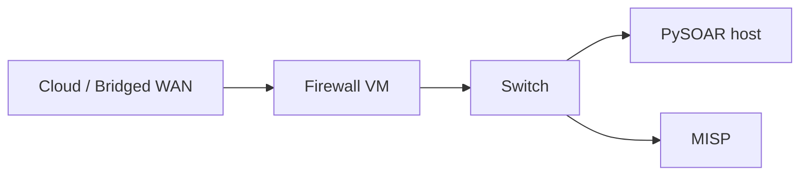

# GNS3 full network lab

The complete historical setup (pfSense VM, PySOAR VM, certificates, MISP) is also covered in the [full install guide](../getting-started/full-install-guide.md).

## Overview



## Recommended topology

| Node | Role | Notes |
|---|---|---|
| Cloud | WAN / bridged access | Firewall WAN NIC |
| Firewall | Perimeter firewall | pfSense CE (amd64) or OPNsense |
| Switch | LAN segment | Connects PySOAR + MISP |
| PySOAR | SOAR runner | Can be the lab Mac, a VM, or a Pi |
| MISP | Threat intel | Docker lab mock or real MISP |

## Apple Silicon (M-series Mac) notes

GNS3 **3.x** ships a local server + QEMU inside `GNS3.app`, so a separate GNS3 VM is optional.

Constraints on Apple Silicon:

- Official pfSense CE / OPNsense GNS3 appliances are **amd64**.
- GNS3.app includes `qemu-system-x86_64` (runs under Rosetta). Expect **slow** but usable installs for API testing.
- Nested KVM is not available; use QEMU TCG emulation (`kvm: disable` / allow without acceleration).
- `ubridge` must be authorized (GNS3 → Help → “Authorize ubridge”, or run the bundled `authorize_ubridge` helper with admin rights).

Suggested workflow on an M-series Mac:

1. Install GNS3 3.x (Homebrew cask or gns3.com).
2. Place images under `~/GNS3/images/QEMU/`:
   - `empty100G.qcow2`
   - `pfSense-CE-2.7.2-RELEASE-amd64.iso` (from Netgate mirrors)
3. Import the built-in **pfSense** appliance (`pfsense.gns3a`) and install to the empty disk.
4. Topology: `Cloud` ↔ `pfSense em0 (WAN)` ; `pfSense em1 (LAN)` ↔ `Switch` ↔ (optional VPCS / host).
5. Install the [pfSense API package](https://github.com/jaredhendrickson13/pfsense-api) on the firewall console.
6. Point local `config/pfsense.yaml` at the firewall management URL (file is gitignored). Use the secrets vault — never commit keys.

If QEMU emulation is too slow, run the firewall as a standalone UTM/Fusion guest and attach GNS3 Cloud nodes to the same host-only/bridged networks.

## Automation options

### Tier 1 — Docker lab (no GNS3)

Use `make lab-up` / `make lab-full-up` for mock-based testing. See [docker-compose.md](docker-compose.md).

### Tier 2 — Ansible host bootstrap

Provision a Debian/Pi host and run:

```bash
cd lab/ansible
ansible-playbook -i inventory.example playbook.yml
```

### Tier 3 — GNS3 + real firewall

1. Import pfSense (or OPNsense) into GNS3 as above
2. Generate lab certificates if using TLS verification:

```bash
bash lab/scripts/generate-certs.sh
```

3. Install the firewall API package and create an API user/key locally
4. Configure gitignored `config/pfsense.yaml` / `config/misp.yaml` (or OPNsense equivalents)
5. Disable in-process mocks and run:

```bash
export PYSOAR_MOCK_INTEGRATIONS=0
python3 pysoar.py --run-playbook test --once
```

## Privacy

Do not commit real firewall URLs, API keys, certificates, or LAN addressing. Keep those in `lab/.env`, `secrets/`, and gitignored `config/*.yaml` (or a private ops repo).

## Troubleshooting

| Issue | Check |
|---|---|
| Appliance won't start on Apple Silicon | Confirm Rosetta is installed; disable KVM requirement on the QEMU template |
| ubridge / link errors | Authorize ubridge; grant Full Disk Access if macOS blocks it |
| PySOAR cannot reach firewall | Management IP, allow rules, `config/pfsense.yaml` URL |
| API auth failures | Key format (`client-id api-key` for pfSense API), secrets vault |
| MISP TLS errors | `generate-certs.sh`, trust CA on the PySOAR host |
